## Shared Bike Demand Prediction Case Study

### Importing and Understanding Data


```python
# Supress Warnings

import warnings
warnings.filterwarnings('ignore')
```


```python
import os
import pandas as pd
import numpy as np
import matplotlib.pyplot as plt
import seaborn as sns
from random import randrange,uniform
from sklearn.metrics import r2_score
from scipy import stats
```


```python
# Load Data
Data_Day = pd.read_csv("day.csv")
```


```python
Data_Day.head()
```


<div>
<style scoped>
    .dataframe tbody tr th:only-of-type {
        vertical-align: middle;
    }

    .dataframe tbody tr th {
        vertical-align: top;
    }

    .dataframe thead th {
        text-align: right;
    }
</style>
<table border="1" class="dataframe">
  <thead>
    <tr style="text-align: right;">
      <th></th>
      <th>instant</th>
      <th>dteday</th>
      <th>season</th>
      <th>yr</th>
      <th>mnth</th>
      <th>holiday</th>
      <th>weekday</th>
      <th>workingday</th>
      <th>weathersit</th>
      <th>temp</th>
      <th>atemp</th>
      <th>hum</th>
      <th>windspeed</th>
      <th>casual</th>
      <th>registered</th>
      <th>cnt</th>
    </tr>
  </thead>
  <tbody>
    <tr>
      <th>0</th>
      <td>1</td>
      <td>01-01-2018</td>
      <td>1</td>
      <td>0</td>
      <td>1</td>
      <td>0</td>
      <td>6</td>
      <td>0</td>
      <td>2</td>
      <td>14.110847</td>
      <td>18.18125</td>
      <td>80.5833</td>
      <td>10.749882</td>
      <td>331</td>
      <td>654</td>
      <td>985</td>
    </tr>
    <tr>
      <th>1</th>
      <td>2</td>
      <td>02-01-2018</td>
      <td>1</td>
      <td>0</td>
      <td>1</td>
      <td>0</td>
      <td>0</td>
      <td>0</td>
      <td>2</td>
      <td>14.902598</td>
      <td>17.68695</td>
      <td>69.6087</td>
      <td>16.652113</td>
      <td>131</td>
      <td>670</td>
      <td>801</td>
    </tr>
    <tr>
      <th>2</th>
      <td>3</td>
      <td>03-01-2018</td>
      <td>1</td>
      <td>0</td>
      <td>1</td>
      <td>0</td>
      <td>1</td>
      <td>1</td>
      <td>1</td>
      <td>8.050924</td>
      <td>9.47025</td>
      <td>43.7273</td>
      <td>16.636703</td>
      <td>120</td>
      <td>1229</td>
      <td>1349</td>
    </tr>
    <tr>
      <th>3</th>
      <td>4</td>
      <td>04-01-2018</td>
      <td>1</td>
      <td>0</td>
      <td>1</td>
      <td>0</td>
      <td>2</td>
      <td>1</td>
      <td>1</td>
      <td>8.200000</td>
      <td>10.60610</td>
      <td>59.0435</td>
      <td>10.739832</td>
      <td>108</td>
      <td>1454</td>
      <td>1562</td>
    </tr>
    <tr>
      <th>4</th>
      <td>5</td>
      <td>05-01-2018</td>
      <td>1</td>
      <td>0</td>
      <td>1</td>
      <td>0</td>
      <td>3</td>
      <td>1</td>
      <td>1</td>
      <td>9.305237</td>
      <td>11.46350</td>
      <td>43.6957</td>
      <td>12.522300</td>
      <td>82</td>
      <td>1518</td>
      <td>1600</td>
    </tr>
  </tbody>
</table>
</div>


# EDA


```python
#Check Type of DataFrame
print(type(Data_Day))
```

    <class 'pandas.core.frame.DataFrame'>


```python
#Data Types of Varaibles

print(Data_Day.dtypes)
```

    instant         int64
    dteday         object
    season          int64
    yr              int64
    mnth            int64
    holiday         int64
    weekday         int64
    workingday      int64
    weathersit      int64
    temp          float64
    atemp         float64
    hum           float64
    windspeed     float64
    casual          int64
    registered      int64
    cnt             int64
    dtype: object


```python
#Dimension
print(Data_Day.shape)
```

    (730, 16)


```python
# Index range

print(Data_Day.index)
```

    RangeIndex(start=0, stop=730, step=1)


```python
#columns 

print(Data_Day.columns)
```

    Index(['instant', 'dteday', 'season', 'yr', 'mnth', 'holiday', 'weekday',
           'workingday', 'weathersit', 'temp', 'atemp', 'hum', 'windspeed',
           'casual', 'registered', 'cnt'],
          dtype='object')


```python
#unique values present in each variable

print(Data_Day.nunique())
```

    instant       730
    dteday        730
    season          4
    yr              2
    mnth           12
    holiday         2
    weekday         7
    workingday      2
    weathersit      3
    temp          498
    atemp         689
    hum           594
    windspeed     649
    casual        605
    registered    678
    cnt           695
    dtype: int64


```python
# variable "instant" can be dropped as it simply represents the index
# Variable "dteday" can be ignored as output is not based on time series analysis
# casual and registered variables can be removed, as these two sums to dependent variable count

Data_Day = Data_Day.drop(Data_Day.columns[[0, 1, 13, 14]], axis = "columns")

print(Data_Day.shape)
```

    (730, 12)


```python
#Defining numeric and categorical variables and saving in specific array

numeric_var = ['temp', 'atemp', 'hum', 'windspeed', 'cnt']

categorical_var = ['season', 'yr', 'mnth', 'holiday', 'weekday', 'workingday', 'weathersit']
```

### Data Preparation

#### Handle missing values:

Check for missing values using Data_Day.isnull().sum(). You can handle missing values by imputing them (filling them in with a strategy), or dropping rows/columns with missing values.


```python
#sum of missing values 

Data_Day.isnull().sum()
```


    season        0
    yr            0
    mnth          0
    holiday       0
    weekday       0
    workingday    0
    weathersit    0
    temp          0
    atemp         0
    hum           0
    windspeed     0
    cnt           0
    dtype: int64


### No missing values found

## Outlier Analysis


```python
sns.pairplot(Data_Day)
plt.show()
```


    
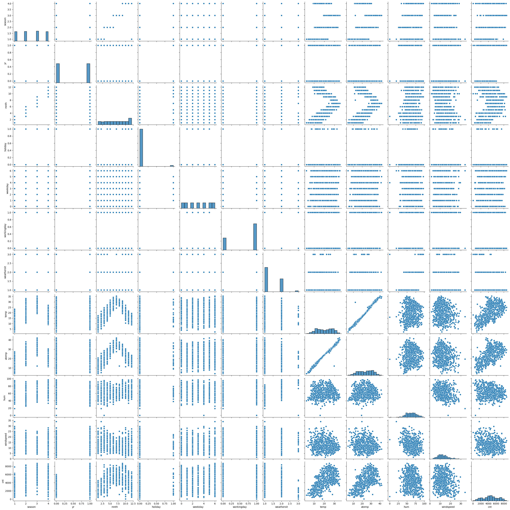
    


```python

# Create a 2x3 grid layout
fig, axes = plt.subplots(2, 3, figsize=(12, 8))  # Adjust figsize for readability

# Iterate through numeric variables and create boxplots
for i, var in enumerate(numeric_var):
    row = i // 3  # Integer division for efficient grid placement
    col = i % 3

    # Create boxplots on subplots in the grid
    sns.boxplot(ax=axes[row, col], y=Data_Day[var], showmeans=True)  # Include mean markers
    axes[row, col].set_xlabel(var)
    axes[row, col].set_ylabel("Values")
    axes[row, col].set_title("Boxplot of " + var)

# Adjust layout (optional, customize as needed)
plt.tight_layout()

# Display the grid of boxplots
plt.show()    
```


    
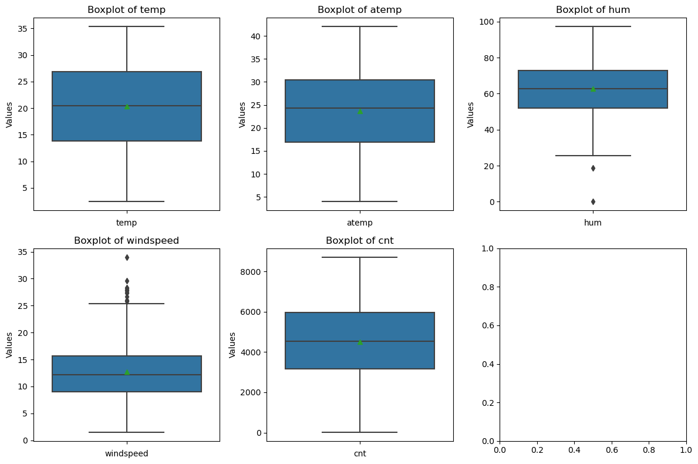
    


### outliers are found in windspeed and humidity variables.


```python
# Identify outliers
#calculate Inner Fence, Outer Fence, and IQR
def identify_and_replace_outliers(data_frame, numeric_columns):
  """
  Identifies and replaces outliers in a DataFrame for specified numeric columns.

  Args:
      data_frame (pandas.DataFrame): The DataFrame containing the data.
      numeric_columns (list): A list containing names of numerical columns.

  Returns:
      pandas.DataFrame: The DataFrame with outliers replaced by NaN.
  """

  for col in numeric_columns:
    # Calculate quartiles and IQR
    q75, q25 = np.percentile(data_frame.loc[:, col], [75, 25])
    iqr = q75 - q25

    # Calculate inner and outer fences
    inner_fence = q25 - (1.5 * iqr)
    upper_fence = q75 + (1.5 * iqr)

    # Print information (optional)
    print(f"Column: {col}")
    print(f"Inner Fence: {inner_fence:.2f}")  # Format for readability
    print(f"Upper Fence: {upper_fence:.2f}")
    print(f"IQR: {iqr:.2f}")

    # Replace outliers with NaN
    data_frame.loc[data_frame[col] < inner_fence, col] = np.nan
    data_frame.loc[data_frame[col] > upper_fence, col] = np.nan

  return data_frame

# Apply the function to identify and replace outliers
day = identify_and_replace_outliers(Data_Day.copy(), numeric_var)
```

    Column: temp
    Inner Fence: -5.79
    Upper Fence: 46.48
    IQR: 13.07
    Column: atemp
    Inner Fence: -3.44
    Upper Fence: 50.78
    IQR: 13.56
    Column: hum
    Inner Fence: 20.52
    Upper Fence: 104.47
    IQR: 20.99
    Column: windspeed
    Inner Fence: -0.83
    Upper Fence: 25.50
    IQR: 6.58
    Column: cnt
    Inner Fence: -1024.62
    Upper Fence: 10160.38
    IQR: 2796.25


```python
Data_Day.isnull().sum()
```


    season        0
    yr            0
    mnth          0
    holiday       0
    weekday       0
    workingday    0
    weathersit    0
    temp          0
    atemp         0
    hum           0
    windspeed     0
    cnt           0
    dtype: int64


```python
# total 15 outliers found. Now, impute the values, by the help of median.

Data_Day['hum'] = Data_Day['hum'].fillna(Data_Day['hum'].median())
Data_Day['windspeed'] = Data_Day['windspeed'].fillna(Data_Day['windspeed'].median())
```


```python
# Check NA Values

Data_Day.isnull().sum()
```


    season        0
    yr            0
    mnth          0
    holiday       0
    weekday       0
    workingday    0
    weathersit    0
    temp          0
    atemp         0
    hum           0
    windspeed     0
    cnt           0
    dtype: int64


## DATA UNDERSTANDING


```python
for i in categorical_var:
    sns.catplot(x = i, y = "cnt", data=Data_Day)
   
  
```


    
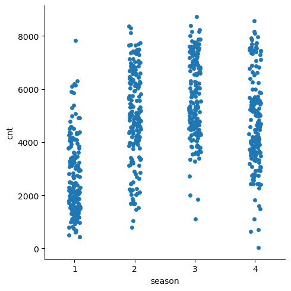
    


    
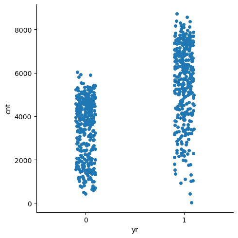
    


    
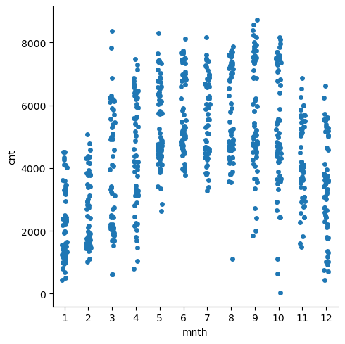
    


    
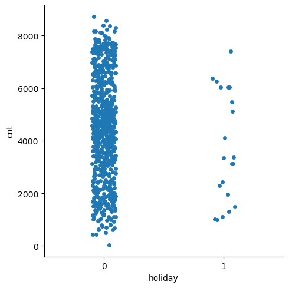
    


    
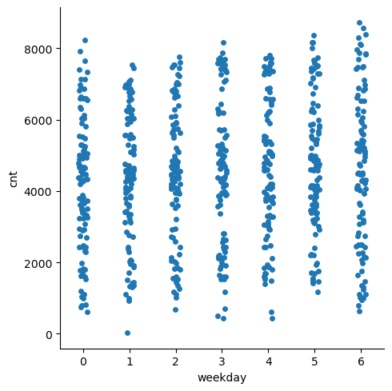
    


    
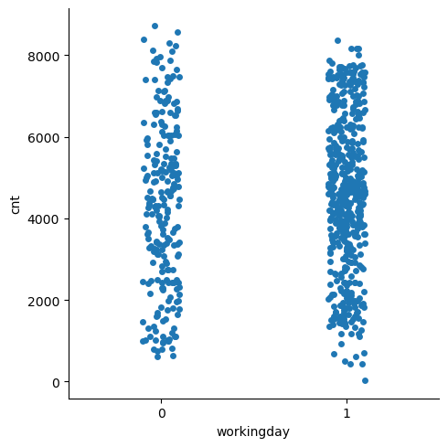
    


    

    


#### It is found that
#### In Season 2, 3 and 4 has the highest count
#### In Year 1 has high count than 0
#### In Months 3 to 10 has got pretty good count
#### On holidays the count is higher compared non-holidays
#### In weekdays, 0 and 6 has the highest count
#### In weather, 1 has the highest count


```python
scatter_plot1 = sns.scatterplot(x="windspeed", y="cnt", hue="hum", data= Data_Day)

plt.title("count with respect to windspeed and humidity")
plt.ylabel("Bike rental count")
plt.xlabel("Windspeed")

```


    Text(0.5, 0, 'Windspeed')


    
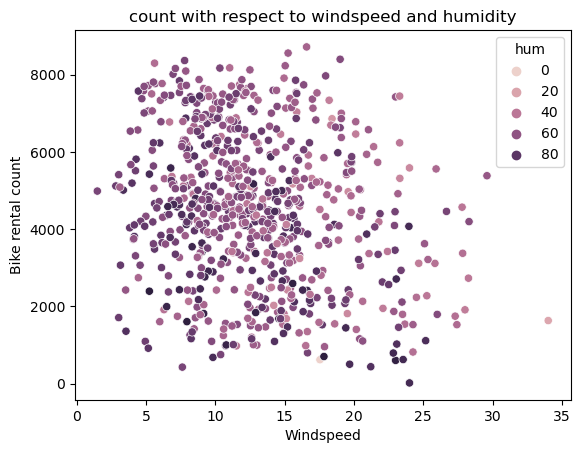
    


### count vs windspeed and humidity, Count is High in ranges, windspeed 0.10 to 0.25  and humidity 0.5 to 0.75


```python
cmap = sns.cubehelix_palette(dark=.9, light=.5, as_cmap=True)

scatter_plot2 = sns.scatterplot(x="weekday", y="cnt",
            hue="season", size="season", sizes = (20, 200), palette=cmap, data= Data_Day)

plt.title("count with respect to weekdays and season")
plt.ylabel("Bike rental count")
plt.xlabel("Weekdays")


```


    Text(0.5, 0, 'Weekdays')


    
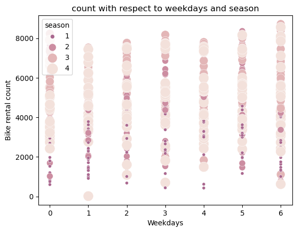
    


### count vs weekdays and season, Count is high in 4th season and 1st and 6th weekdays 


```python
cmap2 = sns.cubehelix_palette(dark=.3, light=.8, as_cmap=True)

scatter_plot3 = sns.scatterplot(x="temp", y="cnt", hue="mnth", size="weathersit", palette="Set2", data=Data_Day)

plt.title("count with respect to temperature, month and weather")
plt.ylabel("Bike rental count")
plt.xlabel("Temperature")


```


    Text(0.5, 0, 'Temperature')


    
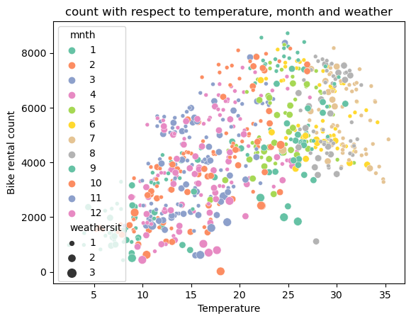
    


### count vs  temperature, month and weather, Count is high in range temperature 0.5 to 0.8, in 8th month and weather is 0.


```python
cmap3 = sns.cubehelix_palette(dark=.3, light=.8, as_cmap=True)

scatter_plot4 = sns.scatterplot(x="mnth", y="cnt", hue="yr", palette="Set2", data= Data_Day)

plt.title("count with respect to year and month")
plt.ylabel("Bike rental count")
plt.xlabel("Month")

```


    Text(0.5, 0, 'Month')


    
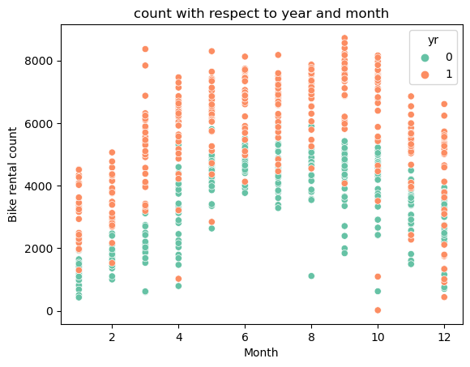
    


### count vs respect to year and month, count is high in year 1, particularly from season 3 to 12 excluding 9 

# FEATURE SELECTION


```python
# Correlation Analysis and Anova test to find varaibles which can be excluded

Data_Day_cor = Data_Day.loc[:, numeric_var]
correlation_result = Data_Day_cor.corr()
print(correlation_result)
```

                   temp     atemp       hum  windspeed       cnt
    temp       1.000000  0.991696  0.128565  -0.158186  0.627044
    atemp      0.991696  1.000000  0.141512  -0.183876  0.630685
    hum        0.128565  0.141512  1.000000  -0.248506 -0.098543
    windspeed -0.158186 -0.183876 -0.248506   1.000000 -0.235132
    cnt        0.627044  0.630685 -0.098543  -0.235132  1.000000


```python
heatmap = sns.heatmap(correlation_result, annot=True)
```


    
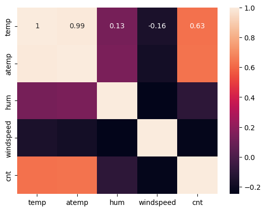
    


### It is found that temperature and atemp are highly correlated with each other.


```python
# Anova Test

import statsmodels.api as sm
from statsmodels.formula.api import ols

for i in categorical_var:
    mod = ols('cnt' + '~' + i, data = Data_Day).fit()
    anova_table = sm.stats.anova_lm(mod, typ = 2)
    print(anova_table)
```

                    sum_sq     df           F        PR(>F)
    season    4.472604e+08    1.0  142.488566  4.006755e-30
    Residual  2.285135e+09  728.0         NaN           NaN
                    sum_sq     df           F        PR(>F)
    yr        8.869095e+08    1.0  349.864652  4.745374e-64
    Residual  1.845485e+09  728.0         NaN           NaN
                    sum_sq     df          F        PR(>F)
    mnth      2.114606e+08    1.0  61.065968  1.932564e-14
    Residual  2.520934e+09  728.0        NaN           NaN
                    sum_sq     df         F    PR(>F)
    holiday   1.292000e+07    1.0  3.458668  0.063324
    Residual  2.719475e+09  728.0       NaN       NaN
                    sum_sq     df         F    PR(>F)
    weekday   1.246204e+07    1.0  3.335511  0.068209
    Residual  2.719933e+09  728.0       NaN       NaN
                      sum_sq     df         F    PR(>F)
    workingday  1.068768e+07    1.0  2.858732  0.091307
    Residual    2.721707e+09  728.0       NaN       NaN
                      sum_sq     df          F        PR(>F)
    weathersit  2.392861e+08    1.0  69.872704  3.202838e-16
    Residual    2.493109e+09  728.0        NaN           NaN


### It is found that holiday, weekday and workingday has p value > 0.05, by which, we accept null hypothesis.


```python
#Dimension Reduction

Data_Day = Data_Day.drop(['atemp', 'holiday', 'weekday', 'workingday'], axis = "columns")
print(Data_Day.shape)
```

    (730, 8)


```python
#Final Variables

numeric_var = ["temp","hum","windspeed","cnt"]   # numeric variables

categorical_var = ["season", "yr", "mnth", "weathersit"]   # categorical variables
```

## FEATURE SCALING


```python
# Check normality 
for i in numeric_var:
    print(i)
    sns.distplot(Data_Day[i], bins = 'auto', color = 'blue')
    plt.title("Distribution of "+i)
    plt.ylabel("Density")
    plt.show()
```

    temp


    
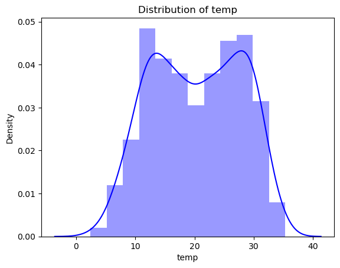
    


    hum


    
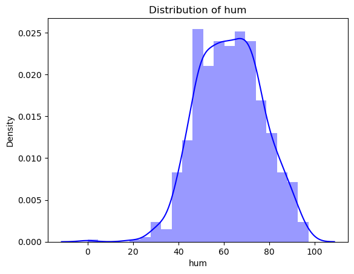
    


    windspeed


    
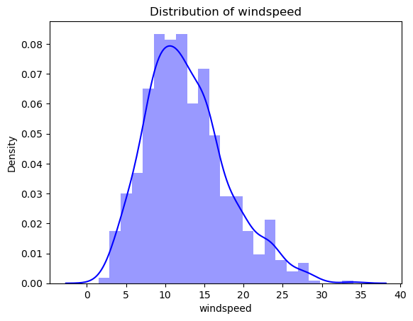
    


    cnt


    
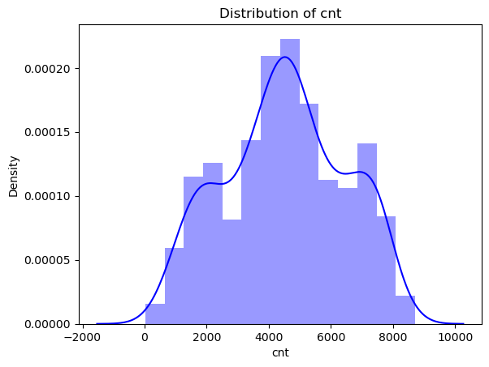
    


### distributions are, approximately symmetric


```python
# Check min and max values 

Data_Day.describe()
```


<div>
<style scoped>
    .dataframe tbody tr th:only-of-type {
        vertical-align: middle;
    }

    .dataframe tbody tr th {
        vertical-align: top;
    }

    .dataframe thead th {
        text-align: right;
    }
</style>
<table border="1" class="dataframe">
  <thead>
    <tr style="text-align: right;">
      <th></th>
      <th>season</th>
      <th>yr</th>
      <th>mnth</th>
      <th>weathersit</th>
      <th>temp</th>
      <th>hum</th>
      <th>windspeed</th>
      <th>cnt</th>
    </tr>
  </thead>
  <tbody>
    <tr>
      <th>count</th>
      <td>730.000000</td>
      <td>730.000000</td>
      <td>730.000000</td>
      <td>730.000000</td>
      <td>730.000000</td>
      <td>730.000000</td>
      <td>730.000000</td>
      <td>730.000000</td>
    </tr>
    <tr>
      <th>mean</th>
      <td>2.498630</td>
      <td>0.500000</td>
      <td>6.526027</td>
      <td>1.394521</td>
      <td>20.319259</td>
      <td>62.765175</td>
      <td>12.763620</td>
      <td>4508.006849</td>
    </tr>
    <tr>
      <th>std</th>
      <td>1.110184</td>
      <td>0.500343</td>
      <td>3.450215</td>
      <td>0.544807</td>
      <td>7.506729</td>
      <td>14.237589</td>
      <td>5.195841</td>
      <td>1936.011647</td>
    </tr>
    <tr>
      <th>min</th>
      <td>1.000000</td>
      <td>0.000000</td>
      <td>1.000000</td>
      <td>1.000000</td>
      <td>2.424346</td>
      <td>0.000000</td>
      <td>1.500244</td>
      <td>22.000000</td>
    </tr>
    <tr>
      <th>25%</th>
      <td>2.000000</td>
      <td>0.000000</td>
      <td>4.000000</td>
      <td>1.000000</td>
      <td>13.811885</td>
      <td>52.000000</td>
      <td>9.041650</td>
      <td>3169.750000</td>
    </tr>
    <tr>
      <th>50%</th>
      <td>3.000000</td>
      <td>0.500000</td>
      <td>7.000000</td>
      <td>1.000000</td>
      <td>20.465826</td>
      <td>62.625000</td>
      <td>12.125325</td>
      <td>4548.500000</td>
    </tr>
    <tr>
      <th>75%</th>
      <td>3.000000</td>
      <td>1.000000</td>
      <td>10.000000</td>
      <td>2.000000</td>
      <td>26.880615</td>
      <td>72.989575</td>
      <td>15.625589</td>
      <td>5966.000000</td>
    </tr>
    <tr>
      <th>max</th>
      <td>4.000000</td>
      <td>1.000000</td>
      <td>12.000000</td>
      <td>3.000000</td>
      <td>35.328347</td>
      <td>97.250000</td>
      <td>34.000021</td>
      <td>8714.000000</td>
    </tr>
  </tbody>
</table>
</div>


### everything is normalized, no need of scaling

# MODEL DEVELOPMENT


```python
df = Data_Day.copy()
Data_Day = df.copy()
```


```python
# Create dummy variables

Data_Day = pd.get_dummies(Data_Day, columns = categorical_var) 

Data_Day.shape
```


    (730, 25)


```python
Data_Day.head()
```


<div>
<style scoped>
    .dataframe tbody tr th:only-of-type {
        vertical-align: middle;
    }

    .dataframe tbody tr th {
        vertical-align: top;
    }

    .dataframe thead th {
        text-align: right;
    }
</style>
<table border="1" class="dataframe">
  <thead>
    <tr style="text-align: right;">
      <th></th>
      <th>temp</th>
      <th>hum</th>
      <th>windspeed</th>
      <th>cnt</th>
      <th>season_1</th>
      <th>season_2</th>
      <th>season_3</th>
      <th>season_4</th>
      <th>yr_0</th>
      <th>yr_1</th>
      <th>...</th>
      <th>mnth_6</th>
      <th>mnth_7</th>
      <th>mnth_8</th>
      <th>mnth_9</th>
      <th>mnth_10</th>
      <th>mnth_11</th>
      <th>mnth_12</th>
      <th>weathersit_1</th>
      <th>weathersit_2</th>
      <th>weathersit_3</th>
    </tr>
  </thead>
  <tbody>
    <tr>
      <th>0</th>
      <td>14.110847</td>
      <td>80.5833</td>
      <td>10.749882</td>
      <td>985</td>
      <td>True</td>
      <td>False</td>
      <td>False</td>
      <td>False</td>
      <td>True</td>
      <td>False</td>
      <td>...</td>
      <td>False</td>
      <td>False</td>
      <td>False</td>
      <td>False</td>
      <td>False</td>
      <td>False</td>
      <td>False</td>
      <td>False</td>
      <td>True</td>
      <td>False</td>
    </tr>
    <tr>
      <th>1</th>
      <td>14.902598</td>
      <td>69.6087</td>
      <td>16.652113</td>
      <td>801</td>
      <td>True</td>
      <td>False</td>
      <td>False</td>
      <td>False</td>
      <td>True</td>
      <td>False</td>
      <td>...</td>
      <td>False</td>
      <td>False</td>
      <td>False</td>
      <td>False</td>
      <td>False</td>
      <td>False</td>
      <td>False</td>
      <td>False</td>
      <td>True</td>
      <td>False</td>
    </tr>
    <tr>
      <th>2</th>
      <td>8.050924</td>
      <td>43.7273</td>
      <td>16.636703</td>
      <td>1349</td>
      <td>True</td>
      <td>False</td>
      <td>False</td>
      <td>False</td>
      <td>True</td>
      <td>False</td>
      <td>...</td>
      <td>False</td>
      <td>False</td>
      <td>False</td>
      <td>False</td>
      <td>False</td>
      <td>False</td>
      <td>False</td>
      <td>True</td>
      <td>False</td>
      <td>False</td>
    </tr>
    <tr>
      <th>3</th>
      <td>8.200000</td>
      <td>59.0435</td>
      <td>10.739832</td>
      <td>1562</td>
      <td>True</td>
      <td>False</td>
      <td>False</td>
      <td>False</td>
      <td>True</td>
      <td>False</td>
      <td>...</td>
      <td>False</td>
      <td>False</td>
      <td>False</td>
      <td>False</td>
      <td>False</td>
      <td>False</td>
      <td>False</td>
      <td>True</td>
      <td>False</td>
      <td>False</td>
    </tr>
    <tr>
      <th>4</th>
      <td>9.305237</td>
      <td>43.6957</td>
      <td>12.522300</td>
      <td>1600</td>
      <td>True</td>
      <td>False</td>
      <td>False</td>
      <td>False</td>
      <td>True</td>
      <td>False</td>
      <td>...</td>
      <td>False</td>
      <td>False</td>
      <td>False</td>
      <td>False</td>
      <td>False</td>
      <td>False</td>
      <td>False</td>
      <td>True</td>
      <td>False</td>
      <td>False</td>
    </tr>
  </tbody>
</table>
<p>5 rows × 25 columns</p>
</div>


```python
df_for_KFCV = Data_Day
```


```python
from sklearn.metrics import accuracy_score
from sklearn.model_selection import train_test_split 
from sklearn.metrics import mean_squared_error
from scipy.stats.stats import pearsonr 
```


```python
#define Error Metrics.

def MAPE(y_actual, y_predicted):
    MAPE = np.mean(np.abs(y_actual-y_predicted)/y_actual)*100
    return MAPE

def Rsquare(y_actual, y_predicted):
    Rsquare = np.corrcoef(y_actual,y_predicted)**2
    return Rsquare
```


```python
#predictors and target

X = Data_Day.drop(['cnt'], axis = "columns")
y = Data_Day['cnt']
```


```python
#divide the data into train and test

X_train, X_test, y_train, y_test = train_test_split(X, y, test_size=.20, random_state=0)
```

## DECISION TREE


```python
from sklearn.tree import DecisionTreeRegressor
DTModel = DecisionTreeRegressor(max_depth=2).fit(X_train,y_train)

# Prediction

DTTest = DTModel.predict(X_test)

# MAPE
DTMape_Test = MAPE(y_test, DTTest)


# Rsquare - Test Data

DTR2_Test = Rsquare(y_test, DTTest)

DTR2_Test1 = DTR2_Test.ravel()

DTR2_Test2 = float(DTR2_Test1[1])


print("MAPE ="+str(DTMape_Test))
print("Accuracy =" + str(100 - DTMape_Test))
print("Rsquare ="+str(DTR2_Test2))
```

    MAPE =37.04448570130954
    Accuracy =62.95551429869046
    Rsquare =0.7180236760820121


```python
DTModel
```


<style>#sk-container-id-1 {
  /* Definition of color scheme common for light and dark mode */
  --sklearn-color-text: black;
  --sklearn-color-line: gray;
  /* Definition of color scheme for unfitted estimators */
  --sklearn-color-unfitted-level-0: #fff5e6;
  --sklearn-color-unfitted-level-1: #f6e4d2;
  --sklearn-color-unfitted-level-2: #ffe0b3;
  --sklearn-color-unfitted-level-3: chocolate;
  /* Definition of color scheme for fitted estimators */
  --sklearn-color-fitted-level-0: #f0f8ff;
  --sklearn-color-fitted-level-1: #d4ebff;
  --sklearn-color-fitted-level-2: #b3dbfd;
  --sklearn-color-fitted-level-3: cornflowerblue;

  /* Specific color for light theme */
  --sklearn-color-text-on-default-background: var(--sg-text-color, var(--theme-code-foreground, var(--jp-content-font-color1, black)));
  --sklearn-color-background: var(--sg-background-color, var(--theme-background, var(--jp-layout-color0, white)));
  --sklearn-color-border-box: var(--sg-text-color, var(--theme-code-foreground, var(--jp-content-font-color1, black)));
  --sklearn-color-icon: #696969;

  @media (prefers-color-scheme: dark) {
    /* Redefinition of color scheme for dark theme */
    --sklearn-color-text-on-default-background: var(--sg-text-color, var(--theme-code-foreground, var(--jp-content-font-color1, white)));
    --sklearn-color-background: var(--sg-background-color, var(--theme-background, var(--jp-layout-color0, #111)));
    --sklearn-color-border-box: var(--sg-text-color, var(--theme-code-foreground, var(--jp-content-font-color1, white)));
    --sklearn-color-icon: #878787;
  }
}

#sk-container-id-1 {
  color: var(--sklearn-color-text);
}

#sk-container-id-1 pre {
  padding: 0;
}

#sk-container-id-1 input.sk-hidden--visually {
  border: 0;
  clip: rect(1px 1px 1px 1px);
  clip: rect(1px, 1px, 1px, 1px);
  height: 1px;
  margin: -1px;
  overflow: hidden;
  padding: 0;
  position: absolute;
  width: 1px;
}

#sk-container-id-1 div.sk-dashed-wrapped {
  border: 1px dashed var(--sklearn-color-line);
  margin: 0 0.4em 0.5em 0.4em;
  box-sizing: border-box;
  padding-bottom: 0.4em;
  background-color: var(--sklearn-color-background);
}

#sk-container-id-1 div.sk-container {
  /* jupyter's `normalize.less` sets `[hidden] { display: none; }`
     but bootstrap.min.css set `[hidden] { display: none !important; }`
     so we also need the `!important` here to be able to override the
     default hidden behavior on the sphinx rendered scikit-learn.org.
     See: https://github.com/scikit-learn/scikit-learn/issues/21755 */
  display: inline-block !important;
  position: relative;
}

#sk-container-id-1 div.sk-text-repr-fallback {
  display: none;
}

div.sk-parallel-item,
div.sk-serial,
div.sk-item {
  /* draw centered vertical line to link estimators */
  background-image: linear-gradient(var(--sklearn-color-text-on-default-background), var(--sklearn-color-text-on-default-background));
  background-size: 2px 100%;
  background-repeat: no-repeat;
  background-position: center center;
}

/* Parallel-specific style estimator block */

#sk-container-id-1 div.sk-parallel-item::after {
  content: "";
  width: 100%;
  border-bottom: 2px solid var(--sklearn-color-text-on-default-background);
  flex-grow: 1;
}

#sk-container-id-1 div.sk-parallel {
  display: flex;
  align-items: stretch;
  justify-content: center;
  background-color: var(--sklearn-color-background);
  position: relative;
}

#sk-container-id-1 div.sk-parallel-item {
  display: flex;
  flex-direction: column;
}

#sk-container-id-1 div.sk-parallel-item:first-child::after {
  align-self: flex-end;
  width: 50%;
}

#sk-container-id-1 div.sk-parallel-item:last-child::after {
  align-self: flex-start;
  width: 50%;
}

#sk-container-id-1 div.sk-parallel-item:only-child::after {
  width: 0;
}

/* Serial-specific style estimator block */

#sk-container-id-1 div.sk-serial {
  display: flex;
  flex-direction: column;
  align-items: center;
  background-color: var(--sklearn-color-background);
  padding-right: 1em;
  padding-left: 1em;
}


/* Toggleable style: style used for estimator/Pipeline/ColumnTransformer box that is
clickable and can be expanded/collapsed.
- Pipeline and ColumnTransformer use this feature and define the default style
- Estimators will overwrite some part of the style using the `sk-estimator` class
*/

/* Pipeline and ColumnTransformer style (default) */

#sk-container-id-1 div.sk-toggleable {
  /* Default theme specific background. It is overwritten whether we have a
  specific estimator or a Pipeline/ColumnTransformer */
  background-color: var(--sklearn-color-background);
}

/* Toggleable label */
#sk-container-id-1 label.sk-toggleable__label {
  cursor: pointer;
  display: block;
  width: 100%;
  margin-bottom: 0;
  padding: 0.5em;
  box-sizing: border-box;
  text-align: center;
}

#sk-container-id-1 label.sk-toggleable__label-arrow:before {
  /* Arrow on the left of the label */
  content: "▸";
  float: left;
  margin-right: 0.25em;
  color: var(--sklearn-color-icon);
}

#sk-container-id-1 label.sk-toggleable__label-arrow:hover:before {
  color: var(--sklearn-color-text);
}

/* Toggleable content - dropdown */

#sk-container-id-1 div.sk-toggleable__content {
  max-height: 0;
  max-width: 0;
  overflow: hidden;
  text-align: left;
  /* unfitted */
  background-color: var(--sklearn-color-unfitted-level-0);
}

#sk-container-id-1 div.sk-toggleable__content.fitted {
  /* fitted */
  background-color: var(--sklearn-color-fitted-level-0);
}

#sk-container-id-1 div.sk-toggleable__content pre {
  margin: 0.2em;
  border-radius: 0.25em;
  color: var(--sklearn-color-text);
  /* unfitted */
  background-color: var(--sklearn-color-unfitted-level-0);
}

#sk-container-id-1 div.sk-toggleable__content.fitted pre {
  /* unfitted */
  background-color: var(--sklearn-color-fitted-level-0);
}

#sk-container-id-1 input.sk-toggleable__control:checked~div.sk-toggleable__content {
  /* Expand drop-down */
  max-height: 200px;
  max-width: 100%;
  overflow: auto;
}

#sk-container-id-1 input.sk-toggleable__control:checked~label.sk-toggleable__label-arrow:before {
  content: "▾";
}

/* Pipeline/ColumnTransformer-specific style */

#sk-container-id-1 div.sk-label input.sk-toggleable__control:checked~label.sk-toggleable__label {
  color: var(--sklearn-color-text);
  background-color: var(--sklearn-color-unfitted-level-2);
}

#sk-container-id-1 div.sk-label.fitted input.sk-toggleable__control:checked~label.sk-toggleable__label {
  background-color: var(--sklearn-color-fitted-level-2);
}

/* Estimator-specific style */

/* Colorize estimator box */
#sk-container-id-1 div.sk-estimator input.sk-toggleable__control:checked~label.sk-toggleable__label {
  /* unfitted */
  background-color: var(--sklearn-color-unfitted-level-2);
}

#sk-container-id-1 div.sk-estimator.fitted input.sk-toggleable__control:checked~label.sk-toggleable__label {
  /* fitted */
  background-color: var(--sklearn-color-fitted-level-2);
}

#sk-container-id-1 div.sk-label label.sk-toggleable__label,
#sk-container-id-1 div.sk-label label {
  /* The background is the default theme color */
  color: var(--sklearn-color-text-on-default-background);
}

/* On hover, darken the color of the background */
#sk-container-id-1 div.sk-label:hover label.sk-toggleable__label {
  color: var(--sklearn-color-text);
  background-color: var(--sklearn-color-unfitted-level-2);
}

/* Label box, darken color on hover, fitted */
#sk-container-id-1 div.sk-label.fitted:hover label.sk-toggleable__label.fitted {
  color: var(--sklearn-color-text);
  background-color: var(--sklearn-color-fitted-level-2);
}

/* Estimator label */

#sk-container-id-1 div.sk-label label {
  font-family: monospace;
  font-weight: bold;
  display: inline-block;
  line-height: 1.2em;
}

#sk-container-id-1 div.sk-label-container {
  text-align: center;
}

/* Estimator-specific */
#sk-container-id-1 div.sk-estimator {
  font-family: monospace;
  border: 1px dotted var(--sklearn-color-border-box);
  border-radius: 0.25em;
  box-sizing: border-box;
  margin-bottom: 0.5em;
  /* unfitted */
  background-color: var(--sklearn-color-unfitted-level-0);
}

#sk-container-id-1 div.sk-estimator.fitted {
  /* fitted */
  background-color: var(--sklearn-color-fitted-level-0);
}

/* on hover */
#sk-container-id-1 div.sk-estimator:hover {
  /* unfitted */
  background-color: var(--sklearn-color-unfitted-level-2);
}

#sk-container-id-1 div.sk-estimator.fitted:hover {
  /* fitted */
  background-color: var(--sklearn-color-fitted-level-2);
}

/* Specification for estimator info (e.g. "i" and "?") */

/* Common style for "i" and "?" */

.sk-estimator-doc-link,
a:link.sk-estimator-doc-link,
a:visited.sk-estimator-doc-link {
  float: right;
  font-size: smaller;
  line-height: 1em;
  font-family: monospace;
  background-color: var(--sklearn-color-background);
  border-radius: 1em;
  height: 1em;
  width: 1em;
  text-decoration: none !important;
  margin-left: 1ex;
  /* unfitted */
  border: var(--sklearn-color-unfitted-level-1) 1pt solid;
  color: var(--sklearn-color-unfitted-level-1);
}

.sk-estimator-doc-link.fitted,
a:link.sk-estimator-doc-link.fitted,
a:visited.sk-estimator-doc-link.fitted {
  /* fitted */
  border: var(--sklearn-color-fitted-level-1) 1pt solid;
  color: var(--sklearn-color-fitted-level-1);
}

/* On hover */
div.sk-estimator:hover .sk-estimator-doc-link:hover,
.sk-estimator-doc-link:hover,
div.sk-label-container:hover .sk-estimator-doc-link:hover,
.sk-estimator-doc-link:hover {
  /* unfitted */
  background-color: var(--sklearn-color-unfitted-level-3);
  color: var(--sklearn-color-background);
  text-decoration: none;
}

div.sk-estimator.fitted:hover .sk-estimator-doc-link.fitted:hover,
.sk-estimator-doc-link.fitted:hover,
div.sk-label-container:hover .sk-estimator-doc-link.fitted:hover,
.sk-estimator-doc-link.fitted:hover {
  /* fitted */
  background-color: var(--sklearn-color-fitted-level-3);
  color: var(--sklearn-color-background);
  text-decoration: none;
}

/* Span, style for the box shown on hovering the info icon */
.sk-estimator-doc-link span {
  display: none;
  z-index: 9999;
  position: relative;
  font-weight: normal;
  right: .2ex;
  padding: .5ex;
  margin: .5ex;
  width: min-content;
  min-width: 20ex;
  max-width: 50ex;
  color: var(--sklearn-color-text);
  box-shadow: 2pt 2pt 4pt #999;
  /* unfitted */
  background: var(--sklearn-color-unfitted-level-0);
  border: .5pt solid var(--sklearn-color-unfitted-level-3);
}

.sk-estimator-doc-link.fitted span {
  /* fitted */
  background: var(--sklearn-color-fitted-level-0);
  border: var(--sklearn-color-fitted-level-3);
}

.sk-estimator-doc-link:hover span {
  display: block;
}

/* "?"-specific style due to the `<a>` HTML tag */

#sk-container-id-1 a.estimator_doc_link {
  float: right;
  font-size: 1rem;
  line-height: 1em;
  font-family: monospace;
  background-color: var(--sklearn-color-background);
  border-radius: 1rem;
  height: 1rem;
  width: 1rem;
  text-decoration: none;
  /* unfitted */
  color: var(--sklearn-color-unfitted-level-1);
  border: var(--sklearn-color-unfitted-level-1) 1pt solid;
}

#sk-container-id-1 a.estimator_doc_link.fitted {
  /* fitted */
  border: var(--sklearn-color-fitted-level-1) 1pt solid;
  color: var(--sklearn-color-fitted-level-1);
}

/* On hover */
#sk-container-id-1 a.estimator_doc_link:hover {
  /* unfitted */
  background-color: var(--sklearn-color-unfitted-level-3);
  color: var(--sklearn-color-background);
  text-decoration: none;
}

#sk-container-id-1 a.estimator_doc_link.fitted:hover {
  /* fitted */
  background-color: var(--sklearn-color-fitted-level-3);
}
</style><div id="sk-container-id-1" class="sk-top-container"><div class="sk-text-repr-fallback"><pre>DecisionTreeRegressor(max_depth=2)</pre><b>In a Jupyter environment, please rerun this cell to show the HTML representation or trust the notebook. <br />On GitHub, the HTML representation is unable to render, please try loading this page with nbviewer.org.</b></div><div class="sk-container" hidden><div class="sk-item"><div class="sk-estimator fitted sk-toggleable"><input class="sk-toggleable__control sk-hidden--visually" id="sk-estimator-id-1" type="checkbox" checked><label for="sk-estimator-id-1" class="sk-toggleable__label fitted sk-toggleable__label-arrow fitted">&nbsp;&nbsp;DecisionTreeRegressor<a class="sk-estimator-doc-link fitted" rel="noreferrer" target="_blank" href="https://scikit-learn.org/1.4/modules/generated/sklearn.tree.DecisionTreeRegressor.html">?<span>Documentation for DecisionTreeRegressor</span></a><span class="sk-estimator-doc-link fitted">i<span>Fitted</span></span></label><div class="sk-toggleable__content fitted"><pre>DecisionTreeRegressor(max_depth=2)</pre></div> </div></div></div></div>


## RANDOM FOREST


```python
from sklearn.ensemble import RandomForestRegressor

RFModel = RandomForestRegressor(n_estimators=100).fit(X_train,y_train)

# Predictions
RFTest = RFModel.predict(X_test)

# MAPE 
RFMape_Test = MAPE(y_test, RFTest)

# Rsquare - Test Data

RFR2_Test = Rsquare(y_test, RFTest)

RFR2_Test1 = RFR2_Test.ravel()

RFR2_Test2 = float(RFR2_Test1[1])

print("MAPE ="+str(RFMape_Test))
print("Accuracy =" + str(100 - RFMape_Test))
print("Rsquare ="+str(RFR2_Test2))
```

    MAPE =21.191740486538137
    Accuracy =78.80825951346186
    Rsquare =0.8907470776709377


```python
RFModel
```


<style>#sk-container-id-2 {
  /* Definition of color scheme common for light and dark mode */
  --sklearn-color-text: black;
  --sklearn-color-line: gray;
  /* Definition of color scheme for unfitted estimators */
  --sklearn-color-unfitted-level-0: #fff5e6;
  --sklearn-color-unfitted-level-1: #f6e4d2;
  --sklearn-color-unfitted-level-2: #ffe0b3;
  --sklearn-color-unfitted-level-3: chocolate;
  /* Definition of color scheme for fitted estimators */
  --sklearn-color-fitted-level-0: #f0f8ff;
  --sklearn-color-fitted-level-1: #d4ebff;
  --sklearn-color-fitted-level-2: #b3dbfd;
  --sklearn-color-fitted-level-3: cornflowerblue;

  /* Specific color for light theme */
  --sklearn-color-text-on-default-background: var(--sg-text-color, var(--theme-code-foreground, var(--jp-content-font-color1, black)));
  --sklearn-color-background: var(--sg-background-color, var(--theme-background, var(--jp-layout-color0, white)));
  --sklearn-color-border-box: var(--sg-text-color, var(--theme-code-foreground, var(--jp-content-font-color1, black)));
  --sklearn-color-icon: #696969;

  @media (prefers-color-scheme: dark) {
    /* Redefinition of color scheme for dark theme */
    --sklearn-color-text-on-default-background: var(--sg-text-color, var(--theme-code-foreground, var(--jp-content-font-color1, white)));
    --sklearn-color-background: var(--sg-background-color, var(--theme-background, var(--jp-layout-color0, #111)));
    --sklearn-color-border-box: var(--sg-text-color, var(--theme-code-foreground, var(--jp-content-font-color1, white)));
    --sklearn-color-icon: #878787;
  }
}

#sk-container-id-2 {
  color: var(--sklearn-color-text);
}

#sk-container-id-2 pre {
  padding: 0;
}

#sk-container-id-2 input.sk-hidden--visually {
  border: 0;
  clip: rect(1px 1px 1px 1px);
  clip: rect(1px, 1px, 1px, 1px);
  height: 1px;
  margin: -1px;
  overflow: hidden;
  padding: 0;
  position: absolute;
  width: 1px;
}

#sk-container-id-2 div.sk-dashed-wrapped {
  border: 1px dashed var(--sklearn-color-line);
  margin: 0 0.4em 0.5em 0.4em;
  box-sizing: border-box;
  padding-bottom: 0.4em;
  background-color: var(--sklearn-color-background);
}

#sk-container-id-2 div.sk-container {
  /* jupyter's `normalize.less` sets `[hidden] { display: none; }`
     but bootstrap.min.css set `[hidden] { display: none !important; }`
     so we also need the `!important` here to be able to override the
     default hidden behavior on the sphinx rendered scikit-learn.org.
     See: https://github.com/scikit-learn/scikit-learn/issues/21755 */
  display: inline-block !important;
  position: relative;
}

#sk-container-id-2 div.sk-text-repr-fallback {
  display: none;
}

div.sk-parallel-item,
div.sk-serial,
div.sk-item {
  /* draw centered vertical line to link estimators */
  background-image: linear-gradient(var(--sklearn-color-text-on-default-background), var(--sklearn-color-text-on-default-background));
  background-size: 2px 100%;
  background-repeat: no-repeat;
  background-position: center center;
}

/* Parallel-specific style estimator block */

#sk-container-id-2 div.sk-parallel-item::after {
  content: "";
  width: 100%;
  border-bottom: 2px solid var(--sklearn-color-text-on-default-background);
  flex-grow: 1;
}

#sk-container-id-2 div.sk-parallel {
  display: flex;
  align-items: stretch;
  justify-content: center;
  background-color: var(--sklearn-color-background);
  position: relative;
}

#sk-container-id-2 div.sk-parallel-item {
  display: flex;
  flex-direction: column;
}

#sk-container-id-2 div.sk-parallel-item:first-child::after {
  align-self: flex-end;
  width: 50%;
}

#sk-container-id-2 div.sk-parallel-item:last-child::after {
  align-self: flex-start;
  width: 50%;
}

#sk-container-id-2 div.sk-parallel-item:only-child::after {
  width: 0;
}

/* Serial-specific style estimator block */

#sk-container-id-2 div.sk-serial {
  display: flex;
  flex-direction: column;
  align-items: center;
  background-color: var(--sklearn-color-background);
  padding-right: 1em;
  padding-left: 1em;
}


/* Toggleable style: style used for estimator/Pipeline/ColumnTransformer box that is
clickable and can be expanded/collapsed.
- Pipeline and ColumnTransformer use this feature and define the default style
- Estimators will overwrite some part of the style using the `sk-estimator` class
*/

/* Pipeline and ColumnTransformer style (default) */

#sk-container-id-2 div.sk-toggleable {
  /* Default theme specific background. It is overwritten whether we have a
  specific estimator or a Pipeline/ColumnTransformer */
  background-color: var(--sklearn-color-background);
}

/* Toggleable label */
#sk-container-id-2 label.sk-toggleable__label {
  cursor: pointer;
  display: block;
  width: 100%;
  margin-bottom: 0;
  padding: 0.5em;
  box-sizing: border-box;
  text-align: center;
}

#sk-container-id-2 label.sk-toggleable__label-arrow:before {
  /* Arrow on the left of the label */
  content: "▸";
  float: left;
  margin-right: 0.25em;
  color: var(--sklearn-color-icon);
}

#sk-container-id-2 label.sk-toggleable__label-arrow:hover:before {
  color: var(--sklearn-color-text);
}

/* Toggleable content - dropdown */

#sk-container-id-2 div.sk-toggleable__content {
  max-height: 0;
  max-width: 0;
  overflow: hidden;
  text-align: left;
  /* unfitted */
  background-color: var(--sklearn-color-unfitted-level-0);
}

#sk-container-id-2 div.sk-toggleable__content.fitted {
  /* fitted */
  background-color: var(--sklearn-color-fitted-level-0);
}

#sk-container-id-2 div.sk-toggleable__content pre {
  margin: 0.2em;
  border-radius: 0.25em;
  color: var(--sklearn-color-text);
  /* unfitted */
  background-color: var(--sklearn-color-unfitted-level-0);
}

#sk-container-id-2 div.sk-toggleable__content.fitted pre {
  /* unfitted */
  background-color: var(--sklearn-color-fitted-level-0);
}

#sk-container-id-2 input.sk-toggleable__control:checked~div.sk-toggleable__content {
  /* Expand drop-down */
  max-height: 200px;
  max-width: 100%;
  overflow: auto;
}

#sk-container-id-2 input.sk-toggleable__control:checked~label.sk-toggleable__label-arrow:before {
  content: "▾";
}

/* Pipeline/ColumnTransformer-specific style */

#sk-container-id-2 div.sk-label input.sk-toggleable__control:checked~label.sk-toggleable__label {
  color: var(--sklearn-color-text);
  background-color: var(--sklearn-color-unfitted-level-2);
}

#sk-container-id-2 div.sk-label.fitted input.sk-toggleable__control:checked~label.sk-toggleable__label {
  background-color: var(--sklearn-color-fitted-level-2);
}

/* Estimator-specific style */

/* Colorize estimator box */
#sk-container-id-2 div.sk-estimator input.sk-toggleable__control:checked~label.sk-toggleable__label {
  /* unfitted */
  background-color: var(--sklearn-color-unfitted-level-2);
}

#sk-container-id-2 div.sk-estimator.fitted input.sk-toggleable__control:checked~label.sk-toggleable__label {
  /* fitted */
  background-color: var(--sklearn-color-fitted-level-2);
}

#sk-container-id-2 div.sk-label label.sk-toggleable__label,
#sk-container-id-2 div.sk-label label {
  /* The background is the default theme color */
  color: var(--sklearn-color-text-on-default-background);
}

/* On hover, darken the color of the background */
#sk-container-id-2 div.sk-label:hover label.sk-toggleable__label {
  color: var(--sklearn-color-text);
  background-color: var(--sklearn-color-unfitted-level-2);
}

/* Label box, darken color on hover, fitted */
#sk-container-id-2 div.sk-label.fitted:hover label.sk-toggleable__label.fitted {
  color: var(--sklearn-color-text);
  background-color: var(--sklearn-color-fitted-level-2);
}

/* Estimator label */

#sk-container-id-2 div.sk-label label {
  font-family: monospace;
  font-weight: bold;
  display: inline-block;
  line-height: 1.2em;
}

#sk-container-id-2 div.sk-label-container {
  text-align: center;
}

/* Estimator-specific */
#sk-container-id-2 div.sk-estimator {
  font-family: monospace;
  border: 1px dotted var(--sklearn-color-border-box);
  border-radius: 0.25em;
  box-sizing: border-box;
  margin-bottom: 0.5em;
  /* unfitted */
  background-color: var(--sklearn-color-unfitted-level-0);
}

#sk-container-id-2 div.sk-estimator.fitted {
  /* fitted */
  background-color: var(--sklearn-color-fitted-level-0);
}

/* on hover */
#sk-container-id-2 div.sk-estimator:hover {
  /* unfitted */
  background-color: var(--sklearn-color-unfitted-level-2);
}

#sk-container-id-2 div.sk-estimator.fitted:hover {
  /* fitted */
  background-color: var(--sklearn-color-fitted-level-2);
}

/* Specification for estimator info (e.g. "i" and "?") */

/* Common style for "i" and "?" */

.sk-estimator-doc-link,
a:link.sk-estimator-doc-link,
a:visited.sk-estimator-doc-link {
  float: right;
  font-size: smaller;
  line-height: 1em;
  font-family: monospace;
  background-color: var(--sklearn-color-background);
  border-radius: 1em;
  height: 1em;
  width: 1em;
  text-decoration: none !important;
  margin-left: 1ex;
  /* unfitted */
  border: var(--sklearn-color-unfitted-level-1) 1pt solid;
  color: var(--sklearn-color-unfitted-level-1);
}

.sk-estimator-doc-link.fitted,
a:link.sk-estimator-doc-link.fitted,
a:visited.sk-estimator-doc-link.fitted {
  /* fitted */
  border: var(--sklearn-color-fitted-level-1) 1pt solid;
  color: var(--sklearn-color-fitted-level-1);
}

/* On hover */
div.sk-estimator:hover .sk-estimator-doc-link:hover,
.sk-estimator-doc-link:hover,
div.sk-label-container:hover .sk-estimator-doc-link:hover,
.sk-estimator-doc-link:hover {
  /* unfitted */
  background-color: var(--sklearn-color-unfitted-level-3);
  color: var(--sklearn-color-background);
  text-decoration: none;
}

div.sk-estimator.fitted:hover .sk-estimator-doc-link.fitted:hover,
.sk-estimator-doc-link.fitted:hover,
div.sk-label-container:hover .sk-estimator-doc-link.fitted:hover,
.sk-estimator-doc-link.fitted:hover {
  /* fitted */
  background-color: var(--sklearn-color-fitted-level-3);
  color: var(--sklearn-color-background);
  text-decoration: none;
}

/* Span, style for the box shown on hovering the info icon */
.sk-estimator-doc-link span {
  display: none;
  z-index: 9999;
  position: relative;
  font-weight: normal;
  right: .2ex;
  padding: .5ex;
  margin: .5ex;
  width: min-content;
  min-width: 20ex;
  max-width: 50ex;
  color: var(--sklearn-color-text);
  box-shadow: 2pt 2pt 4pt #999;
  /* unfitted */
  background: var(--sklearn-color-unfitted-level-0);
  border: .5pt solid var(--sklearn-color-unfitted-level-3);
}

.sk-estimator-doc-link.fitted span {
  /* fitted */
  background: var(--sklearn-color-fitted-level-0);
  border: var(--sklearn-color-fitted-level-3);
}

.sk-estimator-doc-link:hover span {
  display: block;
}

/* "?"-specific style due to the `<a>` HTML tag */

#sk-container-id-2 a.estimator_doc_link {
  float: right;
  font-size: 1rem;
  line-height: 1em;
  font-family: monospace;
  background-color: var(--sklearn-color-background);
  border-radius: 1rem;
  height: 1rem;
  width: 1rem;
  text-decoration: none;
  /* unfitted */
  color: var(--sklearn-color-unfitted-level-1);
  border: var(--sklearn-color-unfitted-level-1) 1pt solid;
}

#sk-container-id-2 a.estimator_doc_link.fitted {
  /* fitted */
  border: var(--sklearn-color-fitted-level-1) 1pt solid;
  color: var(--sklearn-color-fitted-level-1);
}

/* On hover */
#sk-container-id-2 a.estimator_doc_link:hover {
  /* unfitted */
  background-color: var(--sklearn-color-unfitted-level-3);
  color: var(--sklearn-color-background);
  text-decoration: none;
}

#sk-container-id-2 a.estimator_doc_link.fitted:hover {
  /* fitted */
  background-color: var(--sklearn-color-fitted-level-3);
}
</style><div id="sk-container-id-2" class="sk-top-container"><div class="sk-text-repr-fallback"><pre>RandomForestRegressor()</pre><b>In a Jupyter environment, please rerun this cell to show the HTML representation or trust the notebook. <br />On GitHub, the HTML representation is unable to render, please try loading this page with nbviewer.org.</b></div><div class="sk-container" hidden><div class="sk-item"><div class="sk-estimator fitted sk-toggleable"><input class="sk-toggleable__control sk-hidden--visually" id="sk-estimator-id-2" type="checkbox" checked><label for="sk-estimator-id-2" class="sk-toggleable__label fitted sk-toggleable__label-arrow fitted">&nbsp;&nbsp;RandomForestRegressor<a class="sk-estimator-doc-link fitted" rel="noreferrer" target="_blank" href="https://scikit-learn.org/1.4/modules/generated/sklearn.ensemble.RandomForestRegressor.html">?<span>Documentation for RandomForestRegressor</span></a><span class="sk-estimator-doc-link fitted">i<span>Fitted</span></span></label><div class="sk-toggleable__content fitted"><pre>RandomForestRegressor()</pre></div> </div></div></div></div>


# LINEAR REGRESSION MODEL


```python
import statsmodels.api as sm
LRModel= sm.OLS(y_train.astype(float), X_train.astype(float)).fit()
print(LRModel.summary())
```

                                OLS Regression Results                            
    ==============================================================================
    Dep. Variable:                    cnt   R-squared:                       0.830
    Model:                            OLS   Adj. R-squared:                  0.824
    Method:                 Least Squares   F-statistic:                     137.8
    Date:                Tue, 04 Jun 2024   Prob (F-statistic):          8.17e-202
    Time:                        23:17:50   Log-Likelihood:                -4716.3
    No. Observations:                 584   AIC:                             9475.
    Df Residuals:                     563   BIC:                             9566.
    Df Model:                          20                                         
    Covariance Type:            nonrobust                                         
    ================================================================================
                       coef    std err          t      P>|t|      [0.025      0.975]
    --------------------------------------------------------------------------------
    temp           119.3580     11.661     10.236      0.000      96.454     142.262
    hum            -19.6741      3.518     -5.592      0.000     -26.585     -12.763
    windspeed      -47.2379      7.082     -6.671      0.000     -61.147     -33.328
    season_1       -92.6378    149.781     -0.618      0.537    -386.836     201.560
    season_2       816.0239    149.518      5.458      0.000     522.342    1109.706
    season_3       780.2812    170.330      4.581      0.000     445.721    1114.841
    season_4      1411.6760    169.465      8.330      0.000    1078.815    1744.537
    yr_0           487.5463    150.566      3.238      0.001     191.807     783.285
    yr_1          2427.7970    151.241     16.053      0.000    2130.732    2724.862
    mnth_1          -1.6910    197.954     -0.009      0.993    -390.509     387.127
    mnth_2         121.8227    188.014      0.648      0.517    -247.471     491.117
    mnth_3         536.5025    141.961      3.779      0.000     257.664     815.341
    mnth_4         382.5064    173.697      2.202      0.028      41.332     723.680
    mnth_5         604.1261    183.796      3.287      0.001     243.116     965.136
    mnth_6         250.4789    180.560      1.387      0.166    -104.175     605.133
    mnth_7        -288.1553    221.805     -1.299      0.194    -723.822     147.511
    mnth_8         210.8354    206.163      1.023      0.307    -194.107     615.778
    mnth_9         867.5547    174.567      4.970      0.000     524.673    1210.436
    mnth_10        428.3087    187.489      2.284      0.023      60.045     796.572
    mnth_11       -165.4420    196.358     -0.843      0.400    -551.125     220.241
    mnth_12        -31.5038    169.459     -0.186      0.853    -364.352     301.344
    weathersit_1  1653.8397     92.052     17.966      0.000    1473.032    1834.647
    weathersit_2  1281.8796    110.675     11.582      0.000    1064.494    1499.265
    weathersit_3   -20.3760    223.676     -0.091      0.927    -459.718     418.966
    ==============================================================================
    Omnibus:                       99.951   Durbin-Watson:                   2.028
    Prob(Omnibus):                  0.000   Jarque-Bera (JB):              259.477
    Skew:                          -0.865   Prob(JB):                     4.52e-57
    Kurtosis:                       5.770   Cond. No.                     4.92e+17
    ==============================================================================
    
    Notes:
    [1] Standard Errors assume that the covariance matrix of the errors is correctly specified.
    [2] The smallest eigenvalue is 1.13e-29. This might indicate that there are
    strong multicollinearity problems or that the design matrix is singular.


```python
#Prediction

LRTest = LRModel.predict(X_test)

#MAPE

LRMape_Test = MAPE(y_test, LRTest)


#Rsquare -Test Data

LRR2_Test = Rsquare(y_test.astype(float), LRTest.astype(float))

LRR2_Test1 = LRR2_Test.ravel()

LRR2_Test2 = float(LRR2_Test1[1])


print("MAPE ="+str(LRMape_Test))
print("Accuracy =" + str(100 - LRMape_Test))
print("Rsquare ="+str(LRR2_Test2))


```

    MAPE =20.14331137716431
    Accuracy =79.85668862283569
    Rsquare =0.8698892567467649


# KFold Cross Validation


```python
df_for_KFCV.head()
```


<div>
<style scoped>
    .dataframe tbody tr th:only-of-type {
        vertical-align: middle;
    }

    .dataframe tbody tr th {
        vertical-align: top;
    }

    .dataframe thead th {
        text-align: right;
    }
</style>
<table border="1" class="dataframe">
  <thead>
    <tr style="text-align: right;">
      <th></th>
      <th>temp</th>
      <th>hum</th>
      <th>windspeed</th>
      <th>cnt</th>
      <th>season_1</th>
      <th>season_2</th>
      <th>season_3</th>
      <th>season_4</th>
      <th>yr_0</th>
      <th>yr_1</th>
      <th>...</th>
      <th>mnth_6</th>
      <th>mnth_7</th>
      <th>mnth_8</th>
      <th>mnth_9</th>
      <th>mnth_10</th>
      <th>mnth_11</th>
      <th>mnth_12</th>
      <th>weathersit_1</th>
      <th>weathersit_2</th>
      <th>weathersit_3</th>
    </tr>
  </thead>
  <tbody>
    <tr>
      <th>0</th>
      <td>14.110847</td>
      <td>80.5833</td>
      <td>10.749882</td>
      <td>985</td>
      <td>True</td>
      <td>False</td>
      <td>False</td>
      <td>False</td>
      <td>True</td>
      <td>False</td>
      <td>...</td>
      <td>False</td>
      <td>False</td>
      <td>False</td>
      <td>False</td>
      <td>False</td>
      <td>False</td>
      <td>False</td>
      <td>False</td>
      <td>True</td>
      <td>False</td>
    </tr>
    <tr>
      <th>1</th>
      <td>14.902598</td>
      <td>69.6087</td>
      <td>16.652113</td>
      <td>801</td>
      <td>True</td>
      <td>False</td>
      <td>False</td>
      <td>False</td>
      <td>True</td>
      <td>False</td>
      <td>...</td>
      <td>False</td>
      <td>False</td>
      <td>False</td>
      <td>False</td>
      <td>False</td>
      <td>False</td>
      <td>False</td>
      <td>False</td>
      <td>True</td>
      <td>False</td>
    </tr>
    <tr>
      <th>2</th>
      <td>8.050924</td>
      <td>43.7273</td>
      <td>16.636703</td>
      <td>1349</td>
      <td>True</td>
      <td>False</td>
      <td>False</td>
      <td>False</td>
      <td>True</td>
      <td>False</td>
      <td>...</td>
      <td>False</td>
      <td>False</td>
      <td>False</td>
      <td>False</td>
      <td>False</td>
      <td>False</td>
      <td>False</td>
      <td>True</td>
      <td>False</td>
      <td>False</td>
    </tr>
    <tr>
      <th>3</th>
      <td>8.200000</td>
      <td>59.0435</td>
      <td>10.739832</td>
      <td>1562</td>
      <td>True</td>
      <td>False</td>
      <td>False</td>
      <td>False</td>
      <td>True</td>
      <td>False</td>
      <td>...</td>
      <td>False</td>
      <td>False</td>
      <td>False</td>
      <td>False</td>
      <td>False</td>
      <td>False</td>
      <td>False</td>
      <td>True</td>
      <td>False</td>
      <td>False</td>
    </tr>
    <tr>
      <th>4</th>
      <td>9.305237</td>
      <td>43.6957</td>
      <td>12.522300</td>
      <td>1600</td>
      <td>True</td>
      <td>False</td>
      <td>False</td>
      <td>False</td>
      <td>True</td>
      <td>False</td>
      <td>...</td>
      <td>False</td>
      <td>False</td>
      <td>False</td>
      <td>False</td>
      <td>False</td>
      <td>False</td>
      <td>False</td>
      <td>True</td>
      <td>False</td>
      <td>False</td>
    </tr>
  </tbody>
</table>
<p>5 rows × 25 columns</p>
</div>


```python
X_kf = df_for_KFCV.drop(['cnt'], axis = "columns")
y_kf = df_for_KFCV['cnt']
```


```python
X_kf.head()
```


<div>
<style scoped>
    .dataframe tbody tr th:only-of-type {
        vertical-align: middle;
    }

    .dataframe tbody tr th {
        vertical-align: top;
    }

    .dataframe thead th {
        text-align: right;
    }
</style>
<table border="1" class="dataframe">
  <thead>
    <tr style="text-align: right;">
      <th></th>
      <th>temp</th>
      <th>hum</th>
      <th>windspeed</th>
      <th>season_1</th>
      <th>season_2</th>
      <th>season_3</th>
      <th>season_4</th>
      <th>yr_0</th>
      <th>yr_1</th>
      <th>mnth_1</th>
      <th>...</th>
      <th>mnth_6</th>
      <th>mnth_7</th>
      <th>mnth_8</th>
      <th>mnth_9</th>
      <th>mnth_10</th>
      <th>mnth_11</th>
      <th>mnth_12</th>
      <th>weathersit_1</th>
      <th>weathersit_2</th>
      <th>weathersit_3</th>
    </tr>
  </thead>
  <tbody>
    <tr>
      <th>0</th>
      <td>14.110847</td>
      <td>80.5833</td>
      <td>10.749882</td>
      <td>True</td>
      <td>False</td>
      <td>False</td>
      <td>False</td>
      <td>True</td>
      <td>False</td>
      <td>True</td>
      <td>...</td>
      <td>False</td>
      <td>False</td>
      <td>False</td>
      <td>False</td>
      <td>False</td>
      <td>False</td>
      <td>False</td>
      <td>False</td>
      <td>True</td>
      <td>False</td>
    </tr>
    <tr>
      <th>1</th>
      <td>14.902598</td>
      <td>69.6087</td>
      <td>16.652113</td>
      <td>True</td>
      <td>False</td>
      <td>False</td>
      <td>False</td>
      <td>True</td>
      <td>False</td>
      <td>True</td>
      <td>...</td>
      <td>False</td>
      <td>False</td>
      <td>False</td>
      <td>False</td>
      <td>False</td>
      <td>False</td>
      <td>False</td>
      <td>False</td>
      <td>True</td>
      <td>False</td>
    </tr>
    <tr>
      <th>2</th>
      <td>8.050924</td>
      <td>43.7273</td>
      <td>16.636703</td>
      <td>True</td>
      <td>False</td>
      <td>False</td>
      <td>False</td>
      <td>True</td>
      <td>False</td>
      <td>True</td>
      <td>...</td>
      <td>False</td>
      <td>False</td>
      <td>False</td>
      <td>False</td>
      <td>False</td>
      <td>False</td>
      <td>False</td>
      <td>True</td>
      <td>False</td>
      <td>False</td>
    </tr>
    <tr>
      <th>3</th>
      <td>8.200000</td>
      <td>59.0435</td>
      <td>10.739832</td>
      <td>True</td>
      <td>False</td>
      <td>False</td>
      <td>False</td>
      <td>True</td>
      <td>False</td>
      <td>True</td>
      <td>...</td>
      <td>False</td>
      <td>False</td>
      <td>False</td>
      <td>False</td>
      <td>False</td>
      <td>False</td>
      <td>False</td>
      <td>True</td>
      <td>False</td>
      <td>False</td>
    </tr>
    <tr>
      <th>4</th>
      <td>9.305237</td>
      <td>43.6957</td>
      <td>12.522300</td>
      <td>True</td>
      <td>False</td>
      <td>False</td>
      <td>False</td>
      <td>True</td>
      <td>False</td>
      <td>True</td>
      <td>...</td>
      <td>False</td>
      <td>False</td>
      <td>False</td>
      <td>False</td>
      <td>False</td>
      <td>False</td>
      <td>False</td>
      <td>True</td>
      <td>False</td>
      <td>False</td>
    </tr>
  </tbody>
</table>
<p>5 rows × 24 columns</p>
</div>


```python
from sklearn.model_selection import cross_val_score
```


```python
cross_val_score(DecisionTreeRegressor(max_depth=2), X_kf,y_kf, cv = 3)
#array([ 0.23365401, -0.23313404,  0.15690143])

DT_Score = cross_val_score(DecisionTreeRegressor(max_depth=2), X_kf,y_kf, cv = 3)
np.average(DT_Score)

```


    0.04767287044043703


```python
cross_val_score(RandomForestRegressor(), X_kf,y_kf, cv = 3)
#array([0.69521348, 0.27999794, 0.452253  ])
RF_Score = cross_val_score(RandomForestRegressor(n_estimators = 100), X_kf,y_kf, cv = 3)
np.average(RF_Score)

```


    0.519176599099266


```python
from sklearn.linear_model import LinearRegression
cross_val_score(LinearRegression(), X_kf,y_kf, cv = 3)
#array([0.73477372, 0.6035598 , 0.54577344])

LR_Score = cross_val_score(LinearRegression(), X_kf,y_kf, cv = 3)
np.average(LR_Score)

```


    0.6349306285443868


```python
 ## SAMPLE INPUT OUTPUT
```


```python
LRModel.predict([[0.4, 0.8, 0.5,2,0,0,0,1,0,1,0,0,0,0,0,0,0,0,0,0,0,1,0,0]])
```


    array([1962.80431064])


```python
#Putting all the variables humidity, weather, temperature , season, month and year,
#it is found that for those particular input we got above result
```


```python

```
